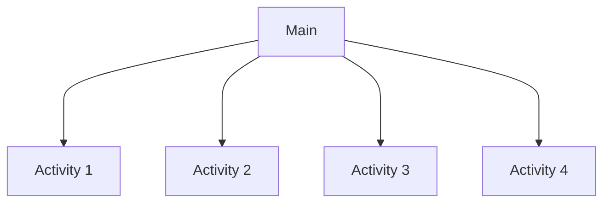

# DW1A3 

The `DW1A3` repository was created to be part of the subject `Web Development` .

Read this in other languages: [English](./README.md), [Português](./README.pt.md)

The `main`page architecture must be like this:

 