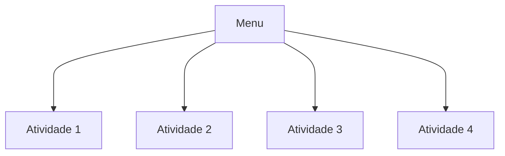

# DW1A3 

O repositório `DW1A3`  foi criado para fazer parte da disciplina de `Web Development` .

Leia em outros idiomas: [English](./README.md), [Português](./README.pt.md)

A `principal` arquitetura  da pagina segue este esquema:

 
